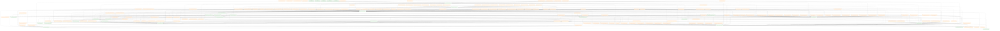

```mermaid
flowchart TD
  N0[slimeknights/tconstruct/TConstruct.java]:::ext
  N1[tconstruct/common/TinkerModule.java]:::ext
  N2[tconstruct/common/TinkerTags.java]:::ext
  N3[common/data/AdvancementsProvider.java]:::ext
  N4[data/loot/BlockLootTableProvider.java]:::ext
  N5[data/loot/GlobalLootModifiersProvider.java]:::ext
  N6[data/loot/LootTableInjectionProvider.java]:::ext
  N7[data/model/TinkerBlockStateProvider.java]:::ext
  N8[data/tags/BlockTagProvider.java]:::ext
  N9[data/tags/ItemTagProvider.java]:::ext
  N10[common/network/TinkerNetwork.java]:::ext
  N11[gadgets/data/GadgetRecipeProvider.java]:::ext
  N12[armor/texture/MaterialArmorTextureSupplier.java]:::ext
  N13[client/book/TinkerBook.java]:::ext
  N14[book/content/AbstractMaterialContent.java]:::ext
  N15[book/content/ArmorMaterialContent.java]:::ext
  N16[book/content/MeleeHarvestMaterialContent.java]:::ext
  N17[book/content/RangedMaterialContent.java]:::ext
  N18[sectiontransformer/materials/TierRangeMaterialSectionTransformer.java]:::ext
  N19[data/material/AbstractMaterialSpriteProvider.java]:::ext
  N20[data/material/AbstractPartSpriteProvider.java]:::ext
  N21[data/material/GeneratorPartTextureJsonGenerator.java]:::ext
  N22[data/material/TrimMaterialPaletteGenerator.java]:::ext
  N23[client/materials/MaterialGeneratorInfo.java]:::ext
  N24[client/materials/MaterialRenderInfo.java]:::ext
  N25[client/materials/MaterialRenderInfoLoader.java]:::ext
  N26[client/materials/MaterialTextureField.java]:::ext
  N27[model/tools/MaterialBlockModel.java]:::ext
  N28[model/tools/MaterialModel.java]:::ext
  N29[model/tools/ToolModel.java]:::ext
  N30[client/modifiers/MaterialModifierModel.java]:::ext
  N31[data/material/AbstractMaterialDataProvider.java]:::ext
  N32[data/material/AbstractMaterialStatsDataProvider.java]:::ext
  N33[data/material/AbstractMaterialTraitDataProvider.java]:::ext
  N34[data/tinkering/AbstractMaterialTagProvider.java]:::ext
  N35[library/events/MaterialsLoadedEvent.java]:::ext
  N36[library/exception/TinkerAPIMaterialException.java]:::ext
  N37[library/exception/TinkerJSONException.java]:::ext
  N38[library/json/IntRange.java]:::ext
  N39[library/json/TinkerLoadables.java]:::ext
  N40[json/loot/AddToolDataFunction.java]:::ext
  N41[json/loot/ToolPartLootEntry.java]:::ext
  N42[loot/equipment/MobEquipment.java]:::ext
  N43[predicate/material/MaterialDefinitionPredicate.java]:::ext
  N44[predicate/material/MaterialHasPartPredicate.java]:::ext
  N45[predicate/material/MaterialIdPredicate.java]:::ext
  N46[predicate/material/MaterialPredicate.java]:::ext
  N47[predicate/material/MaterialPredicateField.java]:::ext
  N48[predicate/material/MaterialStatTypePredicate.java]:::ext
  N49[predicate/material/MaterialTierPredicate.java]:::ext
  N50[predicate/material/MaterialVariantPredicate.java]:::ext
  N51[predicate/tool/HasStatTypePredicate.java]:::ext
  N52[library/materials/IMaterialRegistry.java]:::core
  N53[library/materials/MaterialRegistry.java]:::core
  N54[library/materials/MaterialRegistryImpl.java]:::core
  N55[library/materials/RandomMaterial.java]:::core
  N56[materials/definition/IMaterial.java]:::core
  N57[materials/definition/LazyMaterial.java]:::core
  N58[materials/definition/Material.java]:::core
  N59[materials/definition/MaterialId.java]:::core
  N60[materials/definition/MaterialManager.java]:::core
  N61[materials/definition/MaterialVariant.java]:::core
  N62[materials/definition/MaterialVariantId.java]:::core
  N63[materials/definition/MaterialVariantIdImpl.java]:::core
  N64[materials/definition/UpdateMaterialsPacket.java]:::core
  N65[materials/definition/package-info.java]:::core
  N66[materials/json/MaterialJson.java]:::core
  N67[materials/json/MaterialStatJson.java]:::core
  N68[materials/json/MaterialTraitsJson.java]:::core
  N69[materials/json/package-info.java]:::core
  N70[library/materials/package-info.java]:::core
  N71[materials/stats/IMaterialStats.java]:::core
  N72[materials/stats/IRepairableMaterialStats.java]:::core
  N73[materials/stats/MaterialStatType.java]:::core
  N74[materials/stats/MaterialStatsId.java]:::core
  N75[materials/stats/MaterialStatsManager.java]:::core
  N76[materials/stats/UpdateMaterialStatsPacket.java]:::core
  N77[materials/stats/package-info.java]:::core
  N78[materials/traits/MaterialTraits.java]:::core
  N79[materials/traits/MaterialTraitsManager.java]:::core
  N80[materials/traits/UpdateMaterialTraitsPacket.java]:::core
  N81[materials/traits/package-info.java]:::core
  N82[library/modifiers/ModifierEntry.java]:::ext
  N83[modules/behavior/MaterialRepairModule.java]:::ext
  N84[modules/display/MaterialVariantColorModule.java]:::ext
  N85[casting/material/CompositeCastingRecipe.java]:::ext
  N86[casting/material/MaterialFluidRecipe.java]:::ext
  N87[casting/material/PartSwapCastingRecipe.java]:::ext
  N88[casting/material/ToolCastingRecipe.java]:::ext
  N89[recipe/gtceu/GTConstructRecipeType.java]:::ext
  N90[recipe/gtceu/GTConstructRecipes.java]:::ext
  N91[recipe/ingredient/MaterialIngredient.java]:::ext
  N92[recipe/ingredient/MaterialValueIngredient.java]:::ext
  N93[recipe/material/MaterialRecipe.java]:::ext
  N94[recipe/material/MaterialRecipeCache.java]:::ext
  N95[recipe/material/MaterialValue.java]:::ext
  N96[recipe/material/ShapedMaterialsRecipe.java]:::ext
  N97[recipe/melting/MaterialMeltingRecipe.java]:::ext
  N98[modifiers/adding/SwappableModifierRecipe.java]:::ext
  N99[recipe/partbuilder/ItemPartRecipe.java]:::ext
  N100[recipe/partbuilder/ItemPartRecipeBuilder.java]:::ext
  N101[recipe/partbuilder/PartRecipe.java]:::ext
  N102[partbuilder/recycle/PartBuilderRecycle.java]:::ext
  N103[tinkerstation/building/ToolBuildingRecipe.java]:::ext
  N104[tinkerstation/building/ToolBuildingRecipeBuilder.java]:::ext
  N105[tinkerstation/repairing/IModifierMaterialRepairRecipe.java]:::ext
  N106[tinkerstation/repairing/ISpecializedRepairRecipe.java]:::ext
  N107[tinkerstation/repairing/ModifierMaterialRepairRecipe.java]:::ext
  N108[definition/module/ToolHooks.java]:::ext
  N109[module/display/FixedMaterialToolName.java]:::ext
  N110[module/display/MaterialToolName.java]:::ext
  N111[module/display/MaterialToolNameModule.java]:::ext
  N112[module/display/StatTypesToolNameModule.java]:::ext
  N113[module/display/UniqueMaterialToolName.java]:::ext
  N114[module/material/DefaultMaterialsModule.java]:::ext
  N115[module/material/MaterialRepairModule.java]:::ext
  N116[module/material/MaterialStatsModule.java]:::ext
  N117[module/material/MaterialTraitsModule.java]:::ext
  N118[tools/helper/ToolBuildHandler.java]:::ext
  N119[tools/helper/TooltipUtil.java]:::ext
  N120[tools/nbt/MaterialIdNBT.java]:::ext
  N121[tools/nbt/MaterialNBT.java]:::ext
  N122[tools/nbt/ToolStack.java]:::ext
  N123[tools/part/IMaterialItem.java]:::ext
  N124[tools/part/MaterialItem.java]:::ext
  N125[tools/part/ToolPartItem.java]:::ext
  N126[part/block/MaterialBlock.java]:::ext
  N127[part/block/MaterialBlockEntity.java]:::ext
  N128[library/utils/GenericTagUtil.java]:::ext
  N129[library/utils/IdParser.java]:::ext
  N130[library/utils/Util.java]:::ext
  N131[jei/util/ToolPartSubtypeInterpreter.java]:::ext
  N132[plugin/jsonthings/FlexItemTypes.java]:::ext
  N133[tconstruct/shared/TinkerCommons.java]:::ext
  N134[tconstruct/shared/TinkerMaterials.java]:::core
  N135[shared/block/KnightMetalBlock.java]:::ext
  N136[shared/block/OrientableBlock.java]:::ext
  N137[shared/block/SlimesteelBlock.java]:::ext
  N138[shared/client/ClientGeneratePartTexturesCommand.java]:::ext
  N139[shared/command/TConstructCommand.java]:::ext
  N140[command/argument/MaterialArgument.java]:::ext
  N141[command/argument/MaterialStatsArgument.java]:::ext
  N142[command/argument/MaterialTagSource.java]:::ext
  N143[command/argument/MaterialVariantArgument.java]:::ext
  N144[command/subcommand/MaterialsCommand.java]:::ext
  N145[command/subcommand/ModifierUsageCommand.java]:::ext
  N146[shared/data/CommonRecipeProvider.java]:::ext
  N147[smeltery/data/SmelteryCompat.java]:::ext
  N148[smeltery/data/SmelteryRecipeProvider.java]:::ext
  N149[tables/block/TinkerStationBlock.java]:::ext
  N150[entity/inventory/PartBuilderContainerWrapper.java]:::ext
  N151[entity/table/TinkerStationBlockEntity.java]:::ext
  N152[client/inventory/PartBuilderScreen.java]:::ext
  N153[tables/item/AnvilBlockItem.java]:::ext
  N154[tables/recipe/CraftingTableRepairKitRecipe.java]:::ext
  N155[tables/recipe/PartBuilderToolRecycle.java]:::ext
  N156[tables/recipe/TinkerStationPartSwapping.java]:::ext
  N157[tables/recipe/TinkerStationRepairRecipe.java]:::ext
  N158[tconstruct/tools/TinkerToolParts.java]:::ext
  N159[tconstruct/tools/TinkerTools.java]:::ext
  N160[tools/client/SlimeskullArmorModel.java]:::ext
  N161[client/material/CombatFishingHookRenderer.java]:::ext
  N162[tools/data/ModifierRecipeProvider.java]:::ext
  N163[tools/data/ToolDefinitionDataProvider.java]:::ext
  N164[tools/data/ToolsRecipeProvider.java]:::ext
  N165[data/material/MaterialDataProvider.java]:::ext
  N166[data/material/MaterialIds.java]:::ext
  N167[data/material/MaterialRecipeProvider.java]:::ext
  N168[data/material/MaterialRenderInfoProvider.java]:::ext
  N169[data/material/TrimMaterialProvider.java]:::ext
  N170[data/sprite/TinkerMaterialSpriteProvider.java]:::ext
  N171[data/sprite/TinkerPartSpriteProvider.java]:::ext
  N172[tools/entity/CombatFishingHook.java]:::ext
  N173[tools/item/FakeIngotItem.java]:::ext
  N174[tools/item/FakeStorageBlockItem.java]:::ext
  N175[tools/item/RepairKitItem.java]:::ext
  N176[modifiers/slotless/EmbellishmentModifier.java]:::ext
  N177[traits/ranged/OlympicModifier.java]:::ext
  N178[tools/recipe/TippedToolTransformRecipe.java]:::ext
  N179[tools/stats/GripMaterialStats.java]:::ext
  N180[tools/stats/HandleMaterialStats.java]:::ext
  N181[tools/stats/HeadMaterialStats.java]:::ext
  N182[tools/stats/LimbMaterialStats.java]:::ext
  N183[tools/stats/PlatingMaterialStats.java]:::ext
  N184[tools/stats/SkullStats.java]:::ext
  N185[tools/stats/StatlessMaterialStats.java]:::ext
  N186[tconstruct/world/TinkerWorld.java]:::ext
  N187[world/data/MobEquipmentProvider.java]:::ext
  N188[world/entity/TravelersPlateSlimeEntity.java]:::ext
  N189[world/logic/AncientToolItemListing.java]:::ext
  N0 --> N53
  N0 --> N134
  N1 --> N53
  N1 --> N56
  N2 --> N60
  N3 --> N134
  N4 --> N134
  N5 --> N134
  N6 --> N55
  N7 --> N134
  N8 --> N134
  N9 --> N134
  N10 --> N64
  N10 --> N76
  N10 --> N80
  N11 --> N134
  N12 --> N62
  N13 --> N53
  N14 --> N53
  N14 --> N62
  N15 --> N53
  N15 --> N61
  N16 --> N53
  N17 --> N53
  N18 --> N53
  N18 --> N74
  N19 --> N53
  N19 --> N59
  N19 --> N71
  N19 --> N74
  N20 --> N74
  N21 --> N74
  N22 --> N59
  N23 --> N74
  N24 --> N62
  N25 --> N62
  N26 --> N62
  N27 --> N56
  N28 --> N56
  N28 --> N62
  N29 --> N56
  N30 --> N62
  N31 --> N58
  N31 --> N60
  N31 --> N66
  N32 --> N67
  N32 --> N71
  N32 --> N75
  N33 --> N68
  N33 --> N78
  N33 --> N79
  N34 --> N60
  N39 --> N60
  N40 --> N55
  N41 --> N55
  N42 --> N55
  N43 --> N53
  N43 --> N56
  N45 --> N59
  N46 --> N53
  N46 --> N62
  N47 --> N62
  N48 --> N74
  N50 --> N62
  N51 --> N62
  N51 --> N74
  N52 --> N56
  N52 --> N58
  N52 --> N59
  N52 --> N71
  N52 --> N72
  N52 --> N73
  N52 --> N74
  N53 --> N0
  N53 --> N10
  N53 --> N35
  N53 --> N52
  N53 --> N54
  N53 --> N56
  N53 --> N58
  N53 --> N59
  N53 --> N60
  N53 --> N64
  N53 --> N73
  N53 --> N74
  N53 --> N75
  N53 --> N76
  N53 --> N79
  N53 --> N80
  N53 --> N142
  N53 --> N179
  N53 --> N180
  N53 --> N181
  N53 --> N182
  N53 --> N183
  N53 --> N184
  N53 --> N185
  N54 --> N52
  N54 --> N56
  N54 --> N59
  N54 --> N60
  N54 --> N71
  N54 --> N73
  N54 --> N74
  N54 --> N75
  N54 --> N79
  N55 --> N0
  N55 --> N2
  N55 --> N38
  N55 --> N39
  N55 --> N46
  N55 --> N52
  N55 --> N53
  N55 --> N56
  N55 --> N58
  N55 --> N59
  N55 --> N62
  N55 --> N74
  N55 --> N94
  N55 --> N121
  N55 --> N130
  N56 --> N0
  N56 --> N58
  N56 --> N59
  N57 --> N53
  N57 --> N56
  N57 --> N59
  N58 --> N56
  N58 --> N59
  N58 --> N60
  N59 --> N56
  N59 --> N58
  N59 --> N62
  N59 --> N123
  N60 --> N0
  N60 --> N37
  N60 --> N56
  N60 --> N58
  N60 --> N59
  N60 --> N64
  N60 --> N66
  N60 --> N128
  N60 --> N130
  N61 --> N56
  N61 --> N57
  N61 --> N59
  N61 --> N62
  N62 --> N59
  N62 --> N61
  N62 --> N63
  N62 --> N123
  N62 --> N129
  N63 --> N59
  N63 --> N62
  N64 --> N53
  N64 --> N56
  N64 --> N58
  N64 --> N59
  N64 --> N60
  N64 --> N128
  N68 --> N74
  N71 --> N73
  N71 --> N74
  N71 --> N130
  N72 --> N71
  N73 --> N71
  N73 --> N72
  N73 --> N74
  N74 --> N53
  N75 --> N59
  N75 --> N67
  N75 --> N71
  N75 --> N73
  N75 --> N74
  N75 --> N76
  N75 --> N130
  N76 --> N53
  N76 --> N59
  N76 --> N71
  N76 --> N73
  N76 --> N74
  N76 --> N130
  N78 --> N68
  N78 --> N74
  N78 --> N82
  N79 --> N36
  N79 --> N59
  N79 --> N68
  N79 --> N78
  N79 --> N80
  N79 --> N82
  N79 --> N130
  N80 --> N53
  N80 --> N59
  N80 --> N78
  N83 --> N59
  N83 --> N74
  N84 --> N59
  N85 --> N74
  N86 --> N56
  N86 --> N61
  N86 --> N62
  N87 --> N53
  N87 --> N61
  N88 --> N53
  N88 --> N56
  N88 --> N61
  N88 --> N62
  N89 --> N62
  N90 --> N62
  N91 --> N53
  N91 --> N56
  N93 --> N56
  N93 --> N61
  N93 --> N62
  N94 --> N53
  N95 --> N61
  N96 --> N62
  N97 --> N61
  N97 --> N62
  N98 --> N56
  N98 --> N62
  N99 --> N56
  N99 --> N61
  N99 --> N62
  N100 --> N56
  N101 --> N53
  N101 --> N61
  N102 --> N61
  N103 --> N61
  N103 --> N62
  N104 --> N62
  N105 --> N59
  N105 --> N74
  N106 --> N59
  N107 --> N57
  N108 --> N53
  N109 --> N56
  N110 --> N56
  N111 --> N53
  N112 --> N74
  N113 --> N56
  N114 --> N53
  N114 --> N55
  N115 --> N53
  N115 --> N59
  N115 --> N74
  N116 --> N53
  N116 --> N74
  N117 --> N53
  N117 --> N74
  N118 --> N53
  N118 --> N55
  N118 --> N56
  N118 --> N59
  N118 --> N61
  N118 --> N62
  N119 --> N53
  N120 --> N53
  N120 --> N56
  N120 --> N62
  N121 --> N56
  N121 --> N61
  N121 --> N62
  N122 --> N53
  N123 --> N53
  N123 --> N56
  N123 --> N62
  N124 --> N53
  N124 --> N56
  N124 --> N62
  N125 --> N53
  N125 --> N56
  N126 --> N56
  N127 --> N56
  N127 --> N62
  N131 --> N56
  N132 --> N74
  N133 --> N134
  N134 --> N43
  N134 --> N44
  N134 --> N45
  N134 --> N46
  N134 --> N48
  N134 --> N49
  N134 --> N50
  N134 --> N91
  N134 --> N92
  N134 --> N135
  N134 --> N136
  N134 --> N137
  N134 --> N158
  N134 --> N166
  N138 --> N56
  N138 --> N62
  N138 --> N74
  N139 --> N53
  N140 --> N53
  N140 --> N56
  N140 --> N59
  N141 --> N53
  N141 --> N73
  N141 --> N74
  N142 --> N59
  N142 --> N60
  N143 --> N53
  N143 --> N62
  N144 --> N53
  N145 --> N53
  N146 --> N134
  N147 --> N53
  N147 --> N56
  N148 --> N134
  N149 --> N56
  N150 --> N56
  N151 --> N56
  N151 --> N62
  N152 --> N53
  N153 --> N53
  N153 --> N56
  N154 --> N56
  N155 --> N61
  N156 --> N56
  N157 --> N56
  N158 --> N53
  N159 --> N53
  N159 --> N55
  N159 --> N56
  N159 --> N62
  N160 --> N56
  N160 --> N62
  N161 --> N56
  N162 --> N134
  N163 --> N55
  N164 --> N134
  N165 --> N59
  N166 --> N59
  N166 --> N62
  N167 --> N62
  N167 --> N134
  N168 --> N56
  N168 --> N62
  N169 --> N134
  N170 --> N56
  N170 --> N62
  N171 --> N74
  N172 --> N56
  N172 --> N62
  N173 --> N53
  N174 --> N53
  N175 --> N53
  N175 --> N56
  N176 --> N53
  N176 --> N62
  N177 --> N134
  N178 --> N62
  N179 --> N71
  N179 --> N74
  N180 --> N71
  N180 --> N74
  N181 --> N72
  N181 --> N74
  N182 --> N71
  N182 --> N72
  N182 --> N74
  N183 --> N72
  N183 --> N73
  N183 --> N74
  N184 --> N72
  N184 --> N74
  N185 --> N71
  N185 --> N73
  N185 --> N74
  N186 --> N134
  N187 --> N55
  N188 --> N55
  N189 --> N55
  classDef core fill:#e8f5e9,stroke:#2e7d32,color:#1b5e20;
  classDef ext fill:#fff3e0,stroke:#ef6c00,color:#e65100;
```