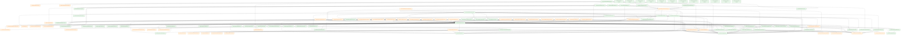

```mermaid
flowchart TD
  N0[slimeknights/tconstruct/TConstruct.java]:::ext
  N1[tconstruct/common/Sounds.java]:::ext
  N2[tconstruct/common/TinkerTags.java]:::ext
  N3[common/config/Config.java]:::ext
  N4[common/data/AdvancementsProvider.java]:::ext
  N5[common/data/FakeRegistryEntry.java]:::ext
  N6[data/loot/BlockLootTableProvider.java]:::ext
  N7[data/loot/EntityLootTableProvider.java]:::ext
  N8[data/loot/LootTableInjectionProvider.java]:::ext
  N9[data/model/TinkerBlockStateProvider.java]:::ext
  N10[data/model/TinkerItemModelProvider.java]:::ext
  N11[data/tags/BlockTagProvider.java]:::ext
  N12[data/tags/EntityTypeTagProvider.java]:::ext
  N13[data/tags/ItemTagProvider.java]:::ext
  N14[common/json/ConfigEnabledCondition.java]:::ext
  N15[common/registration/GeodeItemObject.java]:::ext
  N16[tconstruct/fluids/TinkerFluids.java]:::ext
  N17[tconstruct/gadgets/TinkerGadgets.java]:::ext
  N18[gadgets/data/GadgetRecipeProvider.java]:::ext
  N19[client/particle/SlimeParticle.java]:::ext
  N20[events/teleport/EnderSlimeTeleportEvent.java]:::ext
  N21[loot/equipment/MobEquipmentManager.java]:::ext
  N22[library/materials/RandomMaterial.java]:::ext
  N23[library/modifiers/ModifierManager.java]:::ext
  N24[library/tools/SlotType.java]:::ext
  N25[module/material/ToolMaterialHook.java]:::ext
  N26[tools/helper/ToolBuildHandler.java]:::ext
  N27[tools/nbt/ToolStack.java]:::ext
  N28[library/utils/TeleportHelper.java]:::ext
  N29[library/utils/Util.java]:::ext
  N30[tconstruct/shared/CommonsEvents.java]:::ext
  N31[tconstruct/shared/TinkerCommons.java]:::ext
  N32[tconstruct/shared/TinkerEffects.java]:::ext
  N33[tconstruct/shared/TinkerMaterials.java]:::ext
  N34[shared/block/SlimeType.java]:::ext
  N35[shared/data/CommonRecipeProvider.java]:::ext
  N36[smeltery/data/SmelteryRecipeProvider.java]:::ext
  N37[tconstruct/tools/TinkerModifiers.java]:::ext
  N38[tconstruct/tools/TinkerTools.java]:::ext
  N39[tools/client/SlimeskullArmorModel.java]:::ext
  N40[tools/data/FluidEffectProvider.java]:::ext
  N41[tools/data/ModifierRecipeProvider.java]:::ext
  N42[tools/data/ToolsRecipeProvider.java]:::ext
  N43[data/material/MaterialIds.java]:::ext
  N44[data/material/MaterialRecipeProvider.java]:::ext
  N45[data/material/TrimMaterialProvider.java]:::ext
  N46[tconstruct/world/TinkerHeadType.java]:::core
  N47[tconstruct/world/TinkerStructures.java]:::core
  N48[tconstruct/world/TinkerWorld.java]:::core
  N49[tconstruct/world/WorldClientEvents.java]:::core
  N50[tconstruct/world/WorldEvents.java]:::core
  N51[world/block/BuddingCrystalBlock.java]:::core
  N52[world/block/CongealedSlimeBlock.java]:::core
  N53[world/block/CrystalBlock.java]:::core
  N54[world/block/CrystalClusterBlock.java]:::core
  N55[world/block/DirtType.java]:::core
  N56[world/block/FoliageType.java]:::core
  N57[world/block/PiglinHeadBlock.java]:::core
  N58[world/block/PiglinWallHeadBlock.java]:::core
  N59[world/block/SlimeDirtBlock.java]:::core
  N60[world/block/SlimeFungusBlock.java]:::core
  N61[world/block/SlimeGrassBlock.java]:::core
  N62[world/block/SlimeLeavesBlock.java]:::core
  N63[world/block/SlimeNyliumBlock.java]:::core
  N64[world/block/SlimePropaguleBlock.java]:::core
  N65[world/block/SlimePropaguleLeavesBlock.java]:::core
  N66[world/block/SlimeRootsBlock.java]:::core
  N67[world/block/SlimeSaplingBlock.java]:::core
  N68[world/block/SlimeTallGrassBlock.java]:::core
  N69[world/block/SlimeVineBlock.java]:::core
  N70[world/block/StickySlimeBlock.java]:::core
  N71[world/block/package-info.java]:::core
  N72[world/client/SkullModelHelper.java]:::core
  N73[world/client/SlimeArmorLayer.java]:::core
  N74[world/client/SlimeColorReloadListener.java]:::core
  N75[world/client/SlimeColorizer.java]:::core
  N76[world/client/TerracubeRenderer.java]:::core
  N77[world/client/TinkerSlimeRenderer.java]:::core
  N78[world/client/package-info.java]:::core
  N79[world/data/MobEquipmentProvider.java]:::core
  N80[world/data/StructureRepalleter.java]:::core
  N81[world/data/WorldRecipeProvider.java]:::core
  N82[world/data/WorldgenProvider.java]:::core
  N83[world/data/package-info.java]:::core
  N84[world/entity/ArmoredSlimeEntity.java]:::core
  N85[world/entity/EnderSlimeEntity.java]:::core
  N86[world/entity/SkySlimeEntity.java]:::core
  N87[world/entity/SlimePlacementPredicate.java]:::core
  N88[world/entity/TerracubeEntity.java]:::core
  N89[world/entity/TravelersPlateSlimeEntity.java]:::core
  N90[world/entity/package-info.java]:::core
  N91[world/item/EndermanHeadItem.java]:::core
  N92[world/item/SlimeGrassSeedItem.java]:::core
  N93[world/item/package-info.java]:::core
  N94[world/logic/AncientToolItemListing.java]:::core
  N95[world/logic/package-info.java]:::core
  N96[tconstruct/world/package-info.java]:::core
  N97[worldgen/islands/IslandPiece.java]:::core
  N98[worldgen/islands/IslandPlacement.java]:::core
  N99[worldgen/islands/IslandStructure.java]:::core
  N100[worldgen/islands/package-info.java]:::core
  N101[world/worldgen/package-info.java]:::core
  N102[worldgen/trees/ExtraRootVariantPlacer.java]:::core
  N103[worldgen/trees/LeaveVineDecorator.java]:::core
  N104[worldgen/trees/SlimeTree.java]:::core
  N105[trees/config/SlimeFungusConfig.java]:::core
  N106[trees/config/SlimeTreeConfig.java]:::core
  N107[trees/config/package-info.java]:::core
  N108[trees/feature/SlimeFungusFeature.java]:::core
  N109[trees/feature/SlimeTreeFeature.java]:::core
  N110[trees/feature/package-info.java]:::core
  N111[worldgen/trees/package-info.java]:::core
  N0 --> N47
  N0 --> N48
  N0 --> N82
  N3 --> N46
  N4 --> N47
  N4 --> N48
  N4 --> N56
  N6 --> N48
  N6 --> N55
  N6 --> N56
  N7 --> N48
  N7 --> N84
  N8 --> N48
  N8 --> N56
  N9 --> N48
  N10 --> N48
  N11 --> N46
  N11 --> N48
  N11 --> N55
  N11 --> N56
  N12 --> N48
  N13 --> N46
  N13 --> N48
  N13 --> N55
  N13 --> N56
  N15 --> N51
  N15 --> N53
  N15 --> N54
  N16 --> N48
  N17 --> N56
  N18 --> N48
  N18 --> N56
  N30 --> N48
  N32 --> N48
  N34 --> N55
  N34 --> N56
  N35 --> N48
  N36 --> N46
  N36 --> N48
  N36 --> N56
  N40 --> N55
  N41 --> N46
  N41 --> N48
  N41 --> N56
  N42 --> N46
  N42 --> N48
  N44 --> N48
  N45 --> N48
  N47 --> N0
  N47 --> N29
  N47 --> N80
  N47 --> N97
  N47 --> N99
  N47 --> N102
  N47 --> N103
  N47 --> N105
  N47 --> N106
  N47 --> N108
  N47 --> N109
  N48 --> N0
  N48 --> N1
  N48 --> N2
  N48 --> N15
  N48 --> N16
  N48 --> N21
  N48 --> N29
  N48 --> N31
  N48 --> N33
  N48 --> N34
  N48 --> N37
  N48 --> N46
  N48 --> N47
  N48 --> N52
  N48 --> N54
  N48 --> N55
  N48 --> N56
  N48 --> N57
  N48 --> N58
  N48 --> N59
  N48 --> N60
  N48 --> N61
  N48 --> N62
  N48 --> N63
  N48 --> N64
  N48 --> N65
  N48 --> N66
  N48 --> N67
  N48 --> N68
  N48 --> N69
  N48 --> N70
  N48 --> N79
  N48 --> N81
  N48 --> N85
  N48 --> N86
  N48 --> N87
  N48 --> N88
  N48 --> N91
  N48 --> N92
  N48 --> N104
  N49 --> N0
  N49 --> N19
  N49 --> N34
  N49 --> N39
  N49 --> N43
  N49 --> N46
  N49 --> N48
  N49 --> N56
  N49 --> N72
  N49 --> N74
  N49 --> N75
  N49 --> N76
  N49 --> N77
  N50 --> N0
  N50 --> N3
  N50 --> N46
  N50 --> N48
  N50 --> N94
  N51 --> N15
  N51 --> N53
  N55 --> N0
  N55 --> N34
  N56 --> N0
  N56 --> N34
  N59 --> N48
  N60 --> N2
  N60 --> N48
  N60 --> N55
  N61 --> N2
  N61 --> N48
  N61 --> N55
  N61 --> N56
  N62 --> N2
  N62 --> N56
  N63 --> N2
  N63 --> N56
  N63 --> N61
  N64 --> N2
  N64 --> N56
  N64 --> N67
  N65 --> N48
  N65 --> N56
  N65 --> N62
  N67 --> N48
  N67 --> N56
  N68 --> N48
  N68 --> N56
  N69 --> N2
  N72 --> N0
  N72 --> N46
  N74 --> N0
  N74 --> N75
  N75 --> N56
  N76 --> N0
  N76 --> N73
  N77 --> N0
  N77 --> N73
  N79 --> N0
  N79 --> N2
  N79 --> N5
  N79 --> N22
  N79 --> N38
  N80 --> N0
  N80 --> N16
  N80 --> N34
  N80 --> N48
  N80 --> N55
  N80 --> N56
  N81 --> N14
  N81 --> N31
  N81 --> N34
  N81 --> N48
  N82 --> N2
  N82 --> N15
  N82 --> N34
  N82 --> N48
  N82 --> N56
  N82 --> N69
  N82 --> N99
  N82 --> N102
  N82 --> N103
  N82 --> N105
  N82 --> N106
  N85 --> N20
  N85 --> N28
  N85 --> N43
  N85 --> N48
  N85 --> N89
  N86 --> N1
  N86 --> N43
  N86 --> N48
  N86 --> N89
  N88 --> N48
  N88 --> N84
  N89 --> N2
  N89 --> N22
  N89 --> N23
  N89 --> N24
  N89 --> N25
  N89 --> N27
  N89 --> N38
  N89 --> N84
  N92 --> N48
  N92 --> N55
  N92 --> N69
  N94 --> N2
  N94 --> N22
  N94 --> N26
  N97 --> N47
  N97 --> N69
  N97 --> N99
  N99 --> N47
  N99 --> N48
  N99 --> N97
  N99 --> N98
  N102 --> N47
  N102 --> N48
  N103 --> N47
  N104 --> N47
  N109 --> N2
  classDef core fill:#e8f5e9,stroke:#2e7d32,color:#1b5e20;
  classDef ext fill:#fff3e0,stroke:#ef6c00,color:#e65100;
```